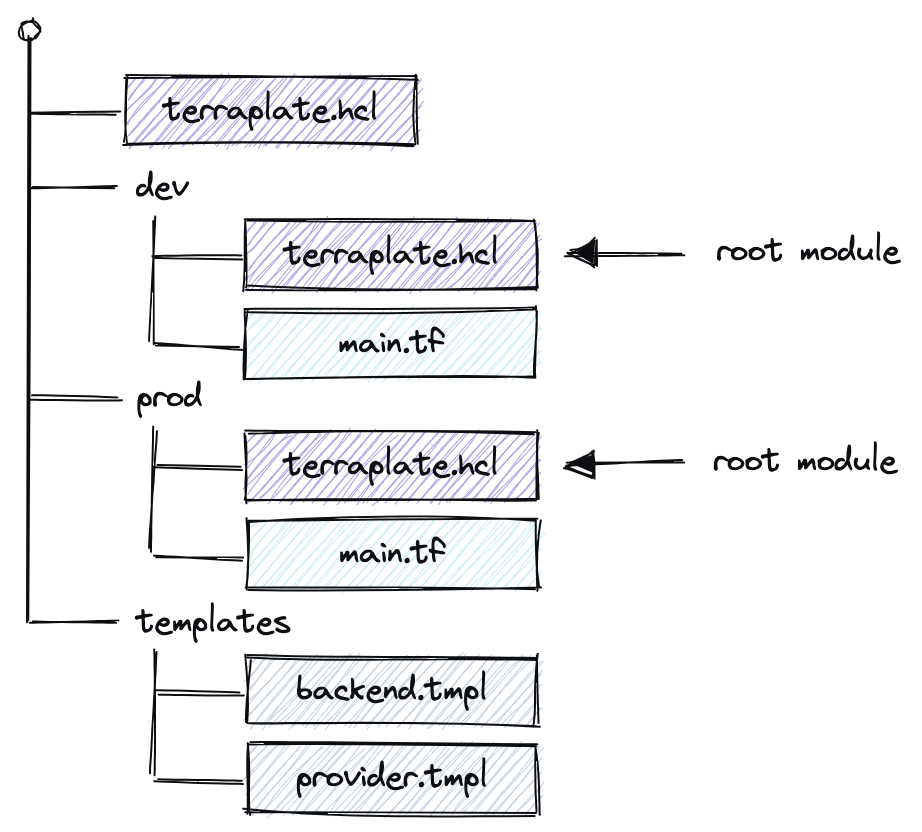

> DRY Terraform with Go Templates

Terraplate is a thin wrapper around [Terraform](https://terraform.io) to keep things DRY and improve the developer experience.

## How it works

Terraplate traverses up and down from the working directory detecting Terraplate files (AKA "Terrafiles"), treating the Terrafiles without child Terrafiles as [Root Modules](https://www.terraform.io/language/modules#the-root-module) (i.e. if a Terrafile does not have any children, it's considered a Root Module where Terraform should be run).

Terraplate builds Terraform files based on your provided templates (using Go Templates).
Define your Terraform snippets once, and reuse them with Go Templates to substitute the values based on the different root modules.

The built files are completely normal Terraform files that should be **version controlled** and can be applied either via the `terraform` CLI or using the `terraplate` CLI.
This way you can focus on writing your Terraform code that creates resources, and let Terraplate handle the boilerplate (like backend, providers, configuration, etc) based on your provided templates.

The goal of Terraplate is to not do any magic: just plain (but DRY) Terraform, which means you can bring your own tools for static analysis, security, policies, testing and deployment.

The `terraplate` CLI allows you to run Terraform across all your Root Modules and provide a summary of plans.

Terraplate is a thin wrapper around Terraform aimed at reducing the amount of duplicate code used when working with multiple different Terraform [root modules](https://www.terraform.io/language/modules#the-root-module).

## Documentation

Please check the [Documentation](https://terraplate.verifa.io)

## Project Status

Terraplate is **stable** and being used in production. There should be no breaking changes unless there is a new major version.

Terraplate does not have a cache, cleanup functionality or overwrite protection.
It's quite dumb, by design, so please be careful that you do not overwrite existing files.

## Examples

See the [examples](./examples) folder.

## License

This code is released under the [Apache-2.0 License](./LICENSE).
