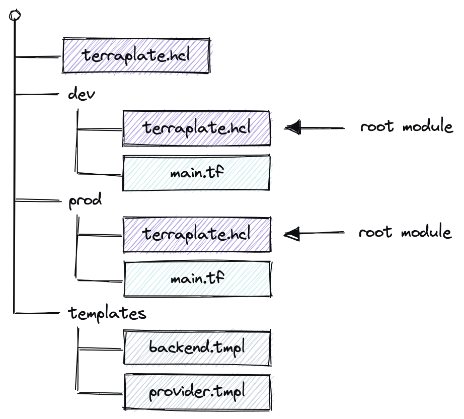

Terraplate is a thin wrapper around [Terraform](https://terraform.io) to keep things DRY and improve the developer experience.

## How it works

Terraplate traverses up and down from the working directory detecting Terraplate files (AKA "Terrafiles"), treating the Terrafiles without child Terrafiles as [Root Modules](https://www.terraform.io/language/modules#the-root-module) (i.e. if a Terrafile does not have any children, it's considered a Root Module where Terraform should be run).

Terraplate builds Terraform files based on your provided templates (using Go Templates).
Define your Terraform snippets once, and reuse them with Go Templates to substitute the values based on the different root modules.

The built files are completely normal Terraform files that should be **version controlled** and can be applied either via the `terraform` CLI or using the `terraplate` CLI.
This way you can focus on writing your Terraform code that creates resources, and let Terraplate handle the boilerplate (like backend, providers, configuration, etc) based on your provided templates.

The goal of Terraplate is to not do any magic: just plain (but DRY) Terraform, which means you can bring your own tools for static analysis, security, policies, testing and deployment.

The `terraplate` CLI allows you to run Terraform across all your Root Modules and provide a summary of plans.

<!--  -->

## Motivation

As you scale your Terraform usage you will start to split your resources out across multiple Terraform [Root Modules](https://www.terraform.io/language/modules#the-root-module).
Each Root Module must define it's own backend (state storage), providers and versions, and this can lead to a lot of copy+paste. Not very DRY.

### Keeping things DRY

There are existing techniques to keep things DRY, two notable mentions:

1. [Terraform Workspaces](https://www.terraform.io/cli/workspaces) solve the issue when you have multiple environments (e.g. prod & dev) for the same infrastructure, not multiple completely unrelated Root Modules. Nonetheless, it helps reduce the amount of copied code. Check the [FAQ on the subject](./faq/terraplate-vs-tf-workspaces.md).
2. [Terragrunt](https://terragrunt.gruntwork.io/): Terragrunt inspired Terraplate and therefore it is no surprise that Terraplate has a similar feel. However, there are differences that we feel warranted the development of another tool. Check the [FAQ on the subject](./faq/terraplate-vs-terragrunt.md).

### Multiple Root Modules

There are existing approaches to running Terraform (e.g. init, plan, apply) over multiple Root Modules (directories):

1. [Terragrunt](https://terragrunt.gruntwork.io/): This is one of Terragrunt's core features, but only works if you use Terragrunt
2. [Terraform Cloud](https://cloud.hashicorp.com/products/terraform): Terraform cloud allows you to create Workspaces for each Root Module
3. [SpaceLift](https://spacelift.io/): SpaceLift is similar to Terraform Cloud but calls it "Stacks" instead of Workspaces.
4. Custom: write a bash script or something and run it in your CI :)

Terraplate's templating is compatible with all the approaches above (in fact Terraplate can template your Terragrunt files! But let's not go there...).
That means you can use Terraplate for **just templating and keeping things DRY** but it also comes with a thin wrapper for invoking Terraform (similar to Terragrunt).

### Drift detection (coming soon)

Terraplate can be run on a regular basis and detect drift in your infrastructure and create notifications.
Currenly only Slack will be supported, but we welcome ideas/suggestions for more!

## Who is it for

### Terraform users with multiple [Root Modules](https://www.terraform.io/language/modules#the-root-module)

Once you start to scale your Terraform usage you will not want to put all of your code into a single root module (i.e. a single state).

The two main benefits Terraplate brings is:

1. Keeping your code DRY and more maintainable
2. Improve developer productivity by spending less time writing boilerplate and running Terraform across all your Root Modules

### Terraform users who want to make [Workspaces](https://www.terraform.io/cli/workspaces) more DRY or avoid them

If you don't find workspaces completely solves the issue of DRY infra, or they are not right for you, Terraplate is worth considering.
Terraplate is not a replacement, but something that can solve the same problem and be used together with workspaces.
Check the [FAQ on the subject]().

### Overcoming limitations of Terraform's dynamic behavior

An example of a limitation is the ability to do `for_each` for providers (or even dynamically reference providers to pass to modules using a `for_each`).
With Terraplate, you can build the `.tf` Terraform file that creates the providers and invokes the modules and overcome this.
It's not the cleanest, but we've found it much friendlier than the numerous workarounds we have to do to achieve the same thing with vanilla Terraform.
