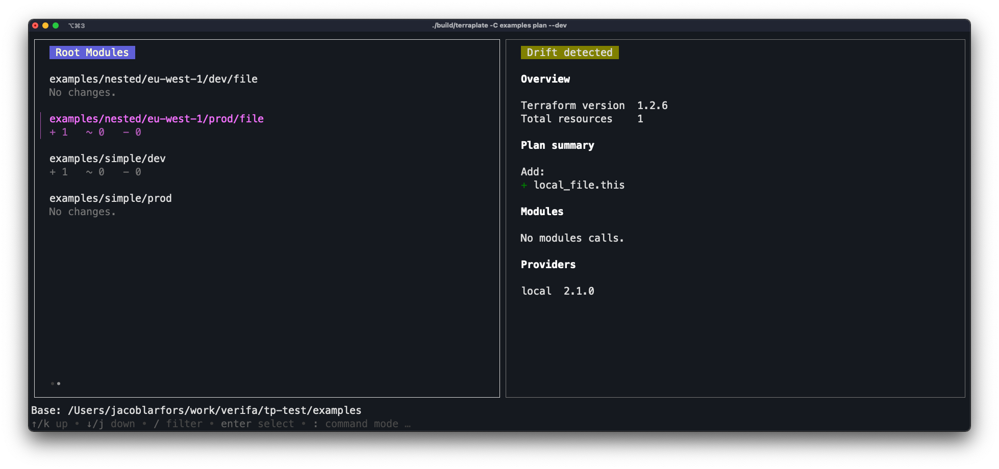

This tutorial gives a *very* quick overview of Terraplate's `dev` mode.

## Dev mode

Terraplate's `dev` mode launches a Terminal UI for working with multiple root modules and executing Terraform via Terraplate.

## Entering dev mode

You can either run `terraplate dev` or `terraplate plan --dev` to start dev mode.

With the `dev` subcommand the TUI starts up immediately.
With the `plan --dev` subcommand, the plan finishes before starting the TUI.

## Command mode

Once in dev mode, you can press `:` to enter command mode, and you can do the following:

- `b` for build
- `i` for init
- `u` for init -upgrade
- `p` for plan
- `a` for apply
- `A` for all (run over all visible root modules)

Finally press enter to run the commands over the root module(s).

For example the following keypresses will build, init (with upgrade) and plan all visible root modules: `:bupA<enter>`.

## Help

Check the help at the bottom of the TUI. You can press `?` to get the extended help.
