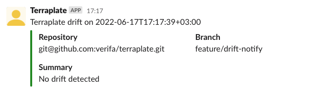
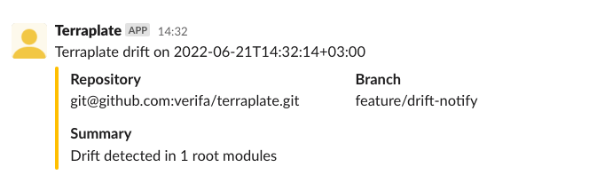
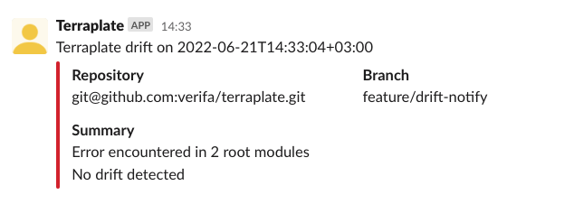

!!! info "Drift detection is currently an experimental feature"

Terraplate uses the `terraform show` command to output a plan as JSON, which it then parses to detect drift.
The `terraplate drift` commands allows you to run Terraform over all your Root Modules that have a `terraplate.hcl` file ("Terrafile"), and send notifications based on the result.

Terraplate only provides the capability to do one-off drift detections, so it is **up to you to make this run at a schedule** (e.g. via CI, or Kubernetes CronJob).

```bash title="Slack notification example"
# Set the Slack API token which is used to authenticate with
export SLACK_API_TOKEN=<slack-token>
# Detect drift and send a notification if there was drift (or an error)
terraplate drift --notify=slack --slack-channel=<slack-channel> --notify-on drift
```

The `--notify` flag says which notification service to use, the `--slack-channel` says which Slack channel to post the notification to, and the `--notify-on` flag accepts either `all` (always send a notificaiton) or `drift` (only send a notification if there's drift detected, or an error occurred).

## Configuration

### Slack API Token

Getting a Slack API token requires you to create an application.

For example, the ArgoCD notes on this are very clear so let's refer to those: <https://argocd-notifications.readthedocs.io/en/stable/services/slack/>

Set the token via the `SLACK_API_TOKEN` environment variable.

### Repository

The Slack notification requires details on your repository to send to Slack.
There is a simple bit of logic in Terraplate to try and detect the repository name using the `origin` remote, and the repository branch using `HEAD`.

If this fails, or you want to give something custom, use the `--repo-name` and `--repo-branch` flags, or set the `TP_REPO_NAME` or `TP_REPO_BRANCH` environment variables.

You can also specify a URL to show under the repository information with the `--results-url` flag, such as a link to your CI logs for easy access.

## Example

### No drift detected

!!! info "This is only shown when the `--notify-on=all`"



### Drift detected



### Error occurred


